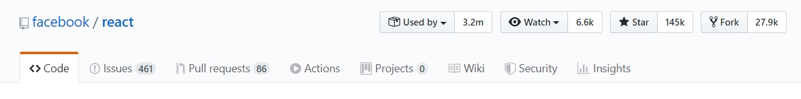
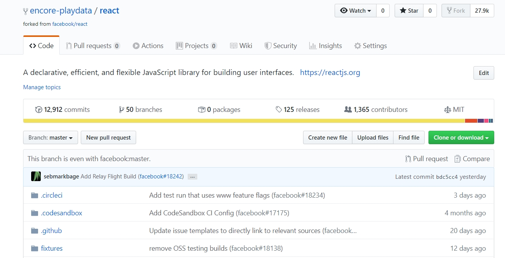
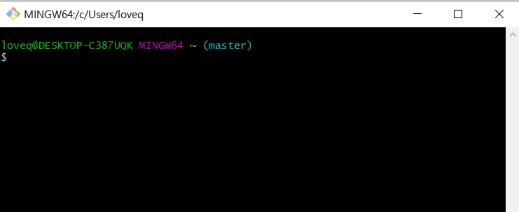

##### 안녕하세요 플레이데이터입니다. 
##### 2020년 3월 교육과정 수강생들의 사전교육을 위한 repo입니다. 
 
 

# [과제 가져오기] 

#### 1. 회원가입을 아직 하지 않은 분들은 회원가입을 먼저 해주세요. 

#### 2. 'Fork' 탭을 클릭해주세요. 

 

#### 3. 'Fork' 버튼을 클릭하면 타자가 소유한 repo를 내 계정으로 가져올 수 있습니다. 

 

#### 4. 이제 프로젝트를 내 로컬환경으로 clone하겠습니다.
#### clone or download 버튼을 누르고 주소를 복사합니다. 

 

#### 5. 로컬 환경으로 돌아가 terminal(git bash 등)을 킵니다. 

 

#### 6. 바탕화면에 폴더를 생성하고 폴더에 파일을 clone합니다.
아래 명령어를 작성하세요. 
 
바탕화면으로 이동
cd Desktop/
 

바탕화면에 폴더 만들기
mkdir playdata
 

생성한 폴더로 이동
cd playdata/
 

폴더 내에 과제를 복사하기
git clone (복사한 주소)
 

잘 복사되었는지 확인하기
ls 
 

복사된 폴더로 들어가기
cd (폴더명)
 

에디터 실행하기
code .

#### 7. 이제 pycharm을 실행해 문제를 확인하고 과제를 해결합니다. 

# 2. commit하기 

#### 1. 문제를 풀던 중 현재 상황을 저장해보겠습니다. 
우선 터미널을 열고 아래 명령어를 입력하세요. 
git status
 

#### 2. git status를 입력하면 변경된 사항들을 확인할 수 있습니다. 

#### 3. 로컬 repo에 과제 올리기 
git add <file name>
   

#### 4. 커밋하기 
git commit -m "전달하고 싶은 메시지" 
 

이런식으로 문제를 하나씩 풀때마다 커밋을 통해 변경된 사항을 저장해주세요. 
 

# 3. 최종 제출하기 

#### 1. 자신의 repo에 변경된 사항을 업데이트합니다. 
git push origin master
 

#### 2. GitHub에서 repository에 업데이트 된 내역을 확인하세요. 

#### 3. 상단 메뉴의 'Pull Request' 탭을 클릭하고, 'New Pull Request' -> 'Create Pull Request' 버튼을 클릭합니다. 

#### 4. 제목에 과정명과 이름을 쓰고 'Create Pull Request'를 클릭합니다. 
